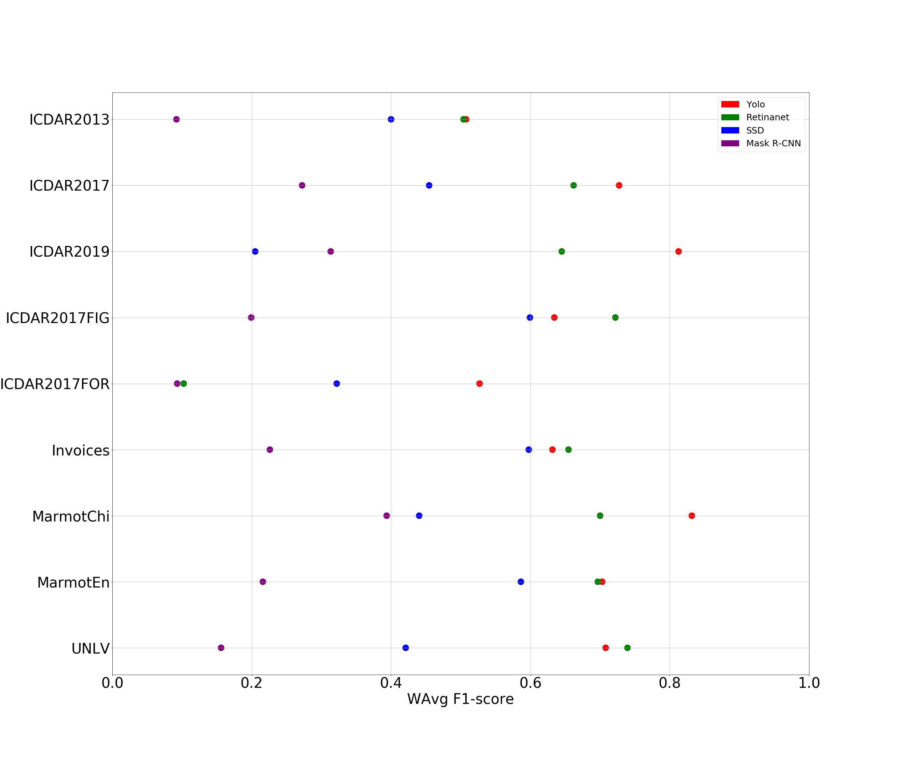

# Close-Domain fine-tuning for table detection

In this project, we show the benefits of using models trained on a close domain, using the [TableBank dataset](https://github.com/doc-analysis/TableBank), for fine-tuning table detection models. In addition, we provide all the tools for using the constructed models, and fine-tune new detection models with custom datasets. 

## TableBank

We have trained several models for the LaTeX part of the TableBank dataset using the [Mask-RCNN](https://arxiv.org/abs/1703.06870), [RetinaNet](https://arxiv.org/abs/1708.02002), [SSD](https://arxiv.org/abs/1512.02325) and [YOLO](https://arxiv.org/abs/1804.02767) algorithms using different deep learning libraries. To this aim, we have used several libraries: 
- [Keras library for Mask RCNN](https://github.com/matterport/Mask_RCNN/)
- [Keras library for RetinaNet](https://github.com/fizyr/keras-retinanet)
- [Implementation of SSD in MXNet](https://gluon.mxnet.io/chapter08_computer-vision/object-detection.html)
- [Implementation of YOLO in Darknet](https://github.com/AlexeyAB/darknet)

### Results

To evaluate our models, we have employed the same metric used in the [ICDAR 2019 Competition on Table Detection](http://sac.founderit.com/evaluation.html). 

|Model|P@0.6|R@0.6|F1@0.6|P@0.7|R@0.7|F1@0.7|P@0.8|R@0.8|F1@0.8|P@0.9|R@0.9|F1@0.9|  WAvgF1|
|---------|---------|---------|---------|---------|---------|---------|---------|---------|---------|---------|---------|---------|---------|
|Mask RCNN|0,94|0,98|0,96|0,94|0,97|0,95|0,93|0,96|0,94|0,84|0,87|0,86|0,92|
|RetinaNet |0,98|0,86|0,92|0,98|0,86|0,92|0,97|0,85|0,91|0,94|0,82|0,87|0,90|
|SSD |0,96|0,97|0,96|0,94|0,95|0,95|0,92|0,92|0,92|0,82|0,82|0,82|0,90|
|YOLO |0,98|0,99|0,98|0,98|0,99|0,98|0,96|0,97|0,96|0,74|0,75|0,75|0,90|

### Model Zoo

The trained models are available in the format used by each framework, and distributed under the [GNU General Public License v3.0](https://www.gnu.org/licenses/gpl-3.0.html)

- Mask RCNN: [weights](https://www.dropbox.com/s/dcl53rl3xqndfdx/mask_rcnn_tablebank_cfg_0002.h5?dl=1).
- RetinaNet: [weights](https://www.dropbox.com/s/iwve914qp6d2nmy/output.h5?dl=1), [classes file](https://raw.githubusercontent.com/holms-ur/fine-tuning/master/code/retinanet/retinanet_classes.csv).
- SSD: [weights](https://www.dropbox.com/s/x95ipfjqoncrzt4/ssd_512_resnet50_tablebank_19.params?dl=1).
- YOLO: [weights](https://www.dropbox.com/s/jbgosn1t83h1bqi/tablasFinaltrain_10000.weights?dl=1), [config file](https://raw.githubusercontent.com/holms-ur/fine-tuning/master/code/yolo/tablasFinaltest416320.cfg), [names file](https://raw.githubusercontent.com/holms-ur/fine-tuning/master/code/yolo/vocTablas.names).

### Colab Notebooks for prediction
You can use the trained models with the following notebooks. 

- [MaskRCNN Notebook](https://colab.research.google.com/drive/1smseOGcUZZjvMfDHnoW8-ancldz-zpOg)
- [RetinaNet Notebook](https://colab.research.google.com/drive/1Zgu7v7jLAKe-xITDbhBe9EDdCUozW-OB)
- [SSD Notebook](https://colab.research.google.com/drive/1s8xoKf1gk0Aqs324genSCXXNVG3R-wJc)
- [YOLO Notebook](https://colab.research.google.com/drive/19x3FL2vUjF0as6CKrYKmjrqsiiUTjkw6)

## Model Zoo for table detection

## Fine-tuning

We provide the necessary tools to create your custom table detection models using as a basis the models that we have constructed using the TableBank dataset. 

        
      
